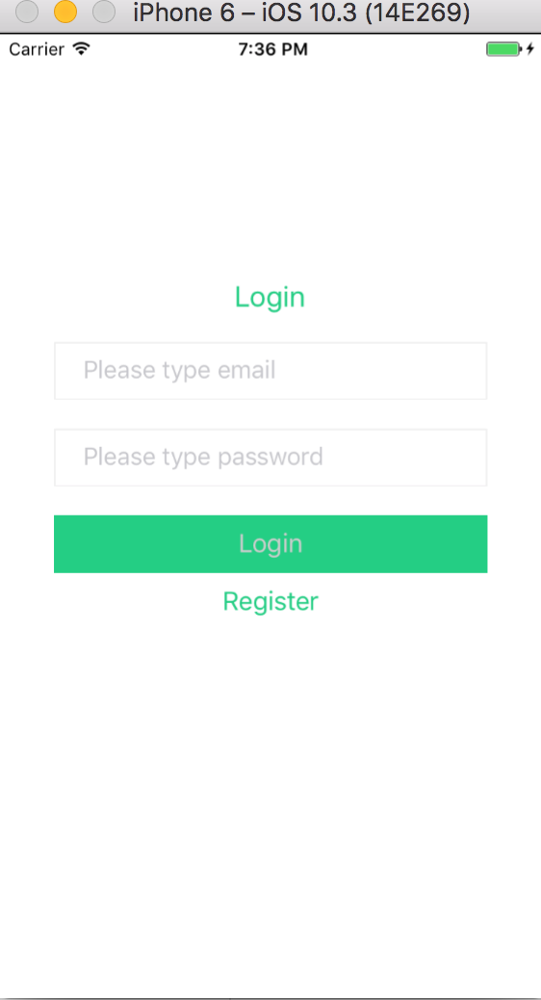
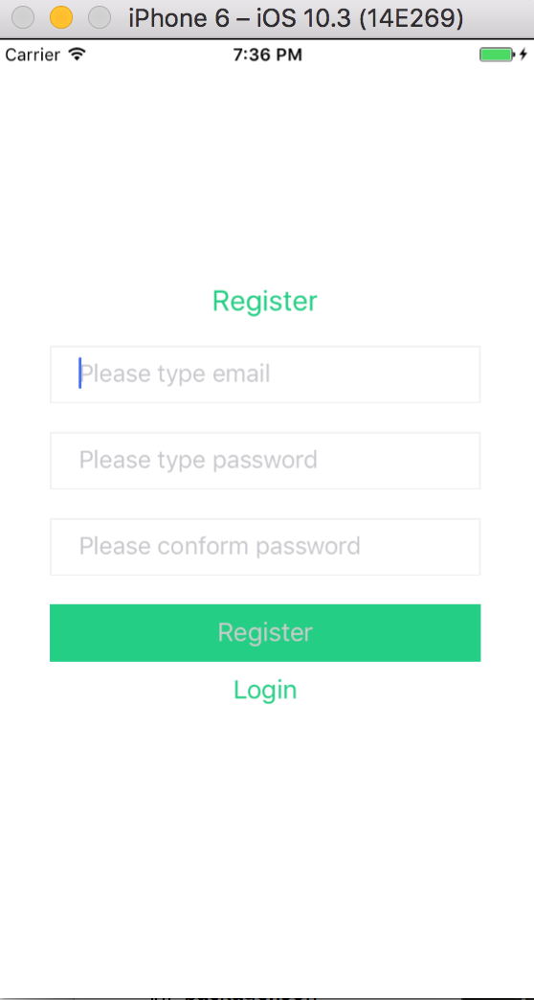
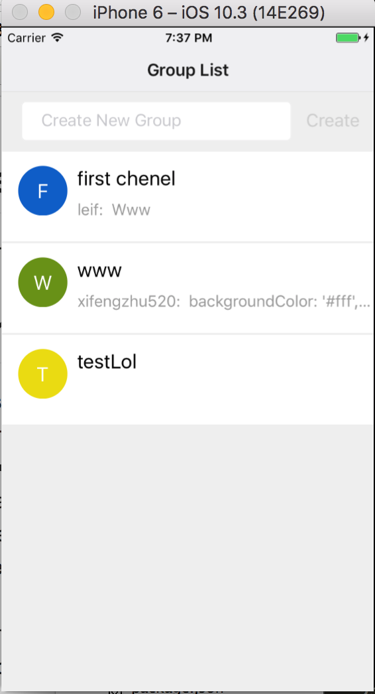
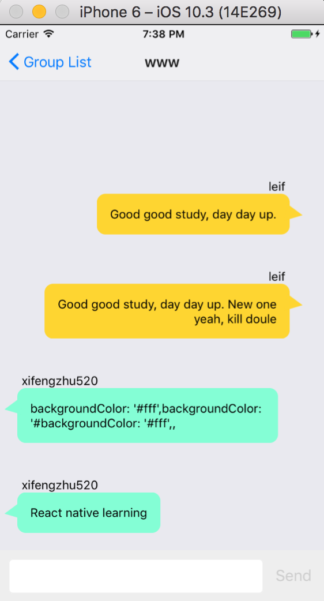

## RNFirebaseChat

Firebase with React Native Build Realtime Chat Example.

## Feature
* Covers lots of awesome features of Firebase:
  * authentication
    * username and password
  * real-time database
* Sign in
* Register
* Create group
* Realtime chat
* Android and iOS support

## DataStructure

```
users/
  user-id
    username - The display name of the user.
    email - The user email.

groups/
  group-id
    name -The group name.
    type - The group type(private and public).
    createdAt- The time at which the group was created.
    owner - The group's owner email.

messages/
  group-id
    message-id
      sender_username
      sender_email
      content - The message content.
      createdAt - The time at which the message was created.
```

## Installing

* `git clone git@github.com:xifengzhu/RNFirebaseChat.git`
* `yarn install`
* `react-native run-ios`


## Preview


